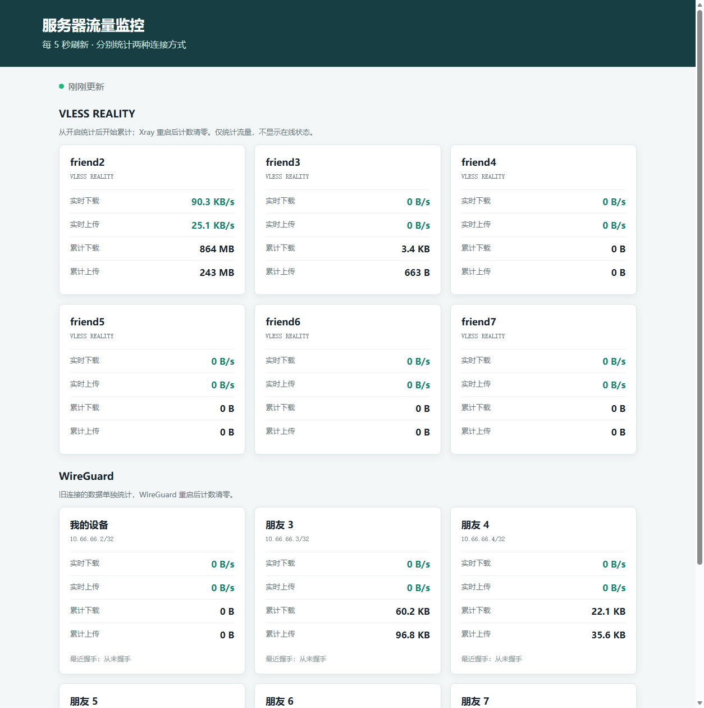
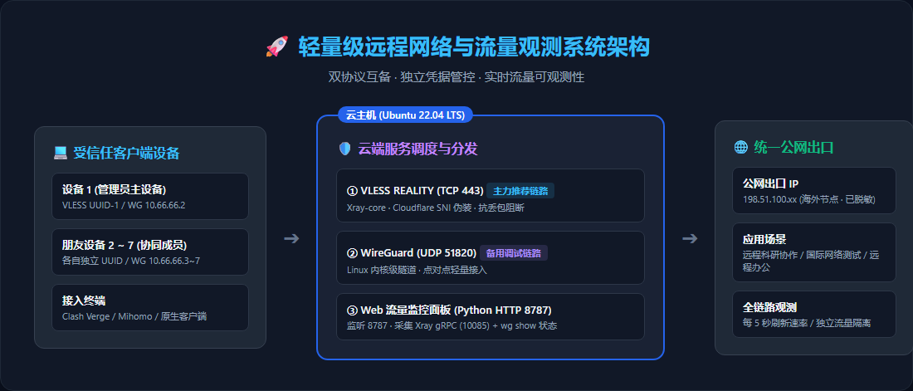
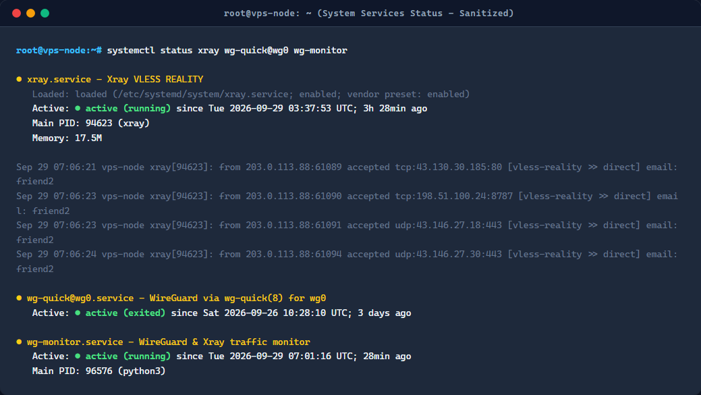
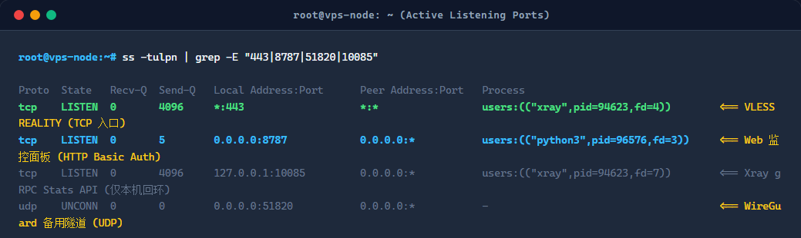
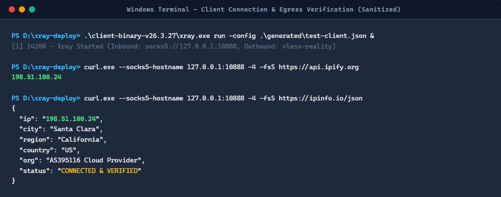

# 🚀 轻量级远程网络与流量观测系统实践

> 一个面向小规模团队的 VPS 远程接入、链路排障与流量观测开源方案。  
> **核心优势**：TCP/UDP 双协议互备 · 独立凭据管控 · 自研轻量级 Web 流量面板 · 极简可复现。

---

## 📸 系统成果概览

| 全景流量观测面板 (Web Dashboard) | 核心系统架构图 (Architecture) |
| :---: | :---: |
|  |  |
| 实时聚合 Xray 与 WireGuard，5s 自动刷新速率与用量 | 独立客户端凭据接入，双协议容灾调度，统一公网出口 |

---

## 一、核心技术方案

### 1. 双协议容灾互备模式
单一协议在复杂网络下极易受阻。本项目在单台云主机（Ubuntu 22.04 LTS）上构建互备双通道：

- **主力链路：VLESS REALITY (TCP 443)**
  - **抗干扰特性**：基于标准 TCP 443 端口，SNI 伪装知名网站（如 Cloudflare），流量特征等同于常规 HTTPS，彻底规避运营商对 UDP 协议的恶意 QoS 限速与丢包断流；
  - **高性能流控**：采用 `xtls-rprx-vision` 流控算法，去除冗余加密开销，实现近乎原生 TCP 的极高吞吐。
- **备用链路：WireGuard (UDP 51820)**
  - Linux 内核级点对点加密隧道，配置轻量，作为纯净网络环境下的直连与备用通道。

### 2. 团队成员独立凭据管控
- **安全隔离**：每位成员分配唯一的 UUID、隧道私钥与独立 IP（如 `10.66.66.2~7`）；
- **权限可控**：某位成员离队或设备丢失时，只需在服务端单点吊销对应 UUID，不影响其他成员；
- **防信道竞争**：彻底杜绝多人共享配置导致的频繁掉线与握手竞争。

### 3. 自研轻量级流量监控服务 (`wg-monitor`)
无需部署庞大的 Prometheus 或重型数据库，直接使用 Python 标准库实现轻量 HTTP 服务：
- **Xray 流量采集**：通过本机回环接口查询 `127.0.0.1:10085` (Xray gRPC Stats API)，精准按 `email` 统计每位成员的 `uplink` 与 `downlink` 字节数；
- **WireGuard 采集**：调用内核级 `wg show dump`，获取各 Peer 的累计传输与最新握手时间；
- **微分测速**：前后两次采样做增量微分，精确算出实时上传/下载带宽（KB/s、MB/s）；
- **安全防护**：监控页面自带 HTTP Basic Auth 鉴权，统计 API 仅监听本地 `127.0.0.1`，杜绝公网直接暴露。

### 4. 为什么基于 V2Ray / Xray 技术生态？（技术渊源与选型考量）
本项目底层采用的 **Xray-core** 与知名的 **V2Ray** 拥有深厚的直系血缘关系（Xray 本质上是 V2Ray 的超集进化版本），本项目深度继承了 V2Ray 体系的核心规范：

- **架构体系继承**：服务端 `config.json` 沿用了 V2Ray 确立的模块化路由与 `inbounds` / `outbounds` 设计规范；
- **流量统计接口继承**：自研监控面板所调用的 `StatsService` gRPC 接口及 `user>>>email>>>traffic>>>*` 数据命名空间，正是 V2Ray 设计并由 Xray 发扬光大的统计子系统；
- **为什么选 Xray 而非传统 V2Ray？**
  | 选型考量 | 传统 V2Ray 方案 | 本项目采用的 Xray 方案 | 优势体现 |
  | :--- | :--- | :--- | :--- |
  | **伪装与部署成本** | 需自购域名并申请/续签 SSL 证书 (WS+TLS) | **REALITY 借壳伪装** (直接借用海外知名站点证书) | **免域名、免证书**，零成本且抗封锁能力更强 |
  | **传输性能表现** | VMess 协议二次加密，CPU 消耗大、吞吐损耗高 | **VLESS + XTLS-Vision** 流控算法 | 消除冗余加密开销，吞吐逼近裸 TCP 极限 |
  | **生态客户端兼容** | 生态主流客户端支持 | Clash Verge、Mihomo、v2rayN 等开箱即用 | 跨平台兼容性好，分发给小白成员极易上手 |

---

## 二、运行实况与链路验证

### 1. 服务端核心服务运行状态
三大服务均通过 `systemd` 守护运行，支持崩溃自动拉起与开机自启：



### 2. 端口监听拓扑
所有端口职责明确，最小化安全暴露面：



- `TCP 443`：VLESS REALITY 外部公网入口
- `TCP 8787`：Web 流量监控面板 (Basic Auth 保护)
- `TCP 127.0.0.1:10085`：Xray 本机 StatsService gRPC 接口 (不对外暴露)
- `UDP 51820`：WireGuard 备用隧道监听

### 3. 客户端连通性与出口 IP 实测
在客户端加载专属生成的订阅配置，通过代理通道访问全球 IP 检查接口：



实测证实客户端网络数据经由加密通道转发，出口 IP 成功转变为海外云主机节点。

---

## 三、极简复现与部署指南

### 1. 项目目录结构
```text
.
├── docs/images/                 # 系统架构图与实测截图 (已脱敏)
├── wg-monitor/                  # 流量监控看板模块
│   ├── app.py                   # Python HTTP 监控服务核心
│   ├── env.example              # 环境变量配置模板
│   └── wg-monitor.service       # systemd 守护配置
├── xray-deploy/                 # Xray 协议部署模块
│   ├── generate.py              # 批量生成密钥与客户端配置脚本
│   ├── config.example.json      # 服务端安全配置模板
│   ├── client.example.yaml      # 客户端 Clash/Mihomo 订阅模板
│   ├── verify.py                # 连通性测试脚本
│   └── xray.service             # Xray systemd 守护配置
└── .gitignore                   # 敏感凭据脱敏过滤规则
```

### 2. 第一步：云服务器环境准备 (Ubuntu 22.04)

```bash
# 1. 开启内核 IPv4 转发
echo "net.ipv4.ip_forward = 1" | sudo tee -a /etc/sysctl.d/99-forward.conf
sudo sysctl -p /etc/sysctl.d/99-forward.conf

# 2. 安装 Xray-core
bash -c "$(curl -L https://github.com/XTLS/Xray-install/raw/main/install-release.sh)"
```

### 3. 第二步：批量生成配置并启动 Xray

克隆本仓库到本地或服务器后：

```bash
# 自动生成 X25519 密钥对、Short ID 及每个成员的独立配置文件
python3 xray-deploy/generate.py ./generated --server YOUR_SERVER_IP

# 将生成的 config.json 复制到服务端配置目录并启动
sudo cp ./generated/config.json /etc/xray/config.json
sudo cp xray-deploy/xray.service /etc/systemd/system/
sudo systemctl daemon-reload
sudo systemctl enable --now xray
```

生成的 `./generated/friend*-clash.yaml` 即可通过私密渠道单独分发给对应成员使用（支持 Clash Verge、Mihomo 内核等）。

### 4. 第三步：部署自研 Web 流量监控面板

```bash
# 1. 拷贝监控源码
sudo mkdir -p /opt/wg-monitor
sudo cp wg-monitor/app.py /opt/wg-monitor/

# 2. 配置账号密码与环境变量
sudo tee /etc/wg-monitor.env <<EOF
WG_MONITOR_USER=admin
WG_MONITOR_PASSWORD=your_secure_password
WG_MONITOR_PORT=8787
EOF

# 3. 配置并启动守护服务
sudo cp wg-monitor/wg-monitor.service /etc/systemd/system/
sudo systemctl daemon-reload
sudo systemctl enable --now wg-monitor
```

浏览器访问 `http://YOUR_SERVER_IP:8787`，输入配置的账号密码，即可实时观测各成员的速率与流量。

---

## 四、核心避坑要点 (FAQ)

1. **服务 active 但连不上？**
   - 检查云厂商控制台的**安全组入站规则**，必须放行 `TCP 443` 与 `TCP 8787`；
   - 检查本地防火墙 `sudo ufw status` 是否阻断了入站端口。
2. **为什么杜绝共用同一份配置？**
   - 多人复用同一凭证会导致 TLS 握手频繁争抢重连，产生偶发断流；
   - 独立配置才能让流量监控看板精准归属各成员用量，并在异常时随时单点撤回。
3. **监控数据清零机制？**
   - 当前内存计数来源于 Xray Stats 内部计时器，服务重启后清零属于正常行为。如需历史月度报表，可在脚本中追加轻量 SQLite 采样持久化。

---

## 五、安全规范说明

- 生产环境中**绝对禁止将包含真实 Private Key、UUID、公网 IP 或 Clash 订阅的 yaml/json 文件提交至代码仓库**；
- 本仓库已配置完整 [`.gitignore`](.gitignore)，所有敏感配置与日志默认忽略，仅提供安全可复现的脱敏模板与工程脚本。
